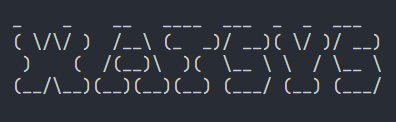

# watsystem

This is a CLI tool that aims to replicate neofetch functionality in a minimal way using rust and the crate called [sysinfo](https://crates.io/crates/sysinfo). Feel free to raise an issue if there's something wrong in my code since I'm trying to improve my writing on rust.


## Quick Start
First you need to clone this repository.
```
git clone https://github.com/FLAKEYCHALK/watsystem.git
```
change the directory to that folder then run this command in order to run **watsystem**.
```
cargo run
```

